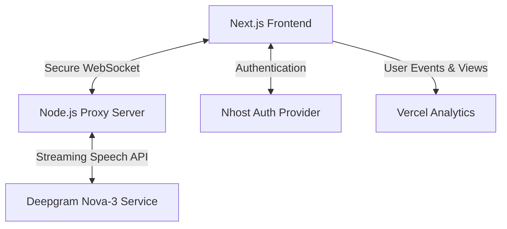

# Proposal & Technical Submission: Live Speech-to-Text Dashboard with Secure Nhost Auth

**Candidate:** Ravindra  
**Portfolio:** [ravindraogg.netlify.app](https://ravindraogg.netlify.app/)  
**Role:** SDE Intern — Live Coding Assessment  

---

## Executive Summary

This repository contains the full source code and technical implementation for the **VocaLabs SDE Intern Assessment**. The task required building a secure, production-ready live speech-to-text dashboard. 

Rather than opting for a basic client-side app that exposes sensitive API keys, this solution implements a **secure, dual-layer architecture**:
1. **Frontend (Next.js 15, App Router, TailwindCSS)**: Interacts with **Nhost** for session management and route protection, captures raw user microphone input using `MediaRecorder` API, streams it via WebSockets, and renders transcription in real-time.
2. **Backend (Node.js & Express)**: Functions as a secure WebSocket gateway/proxy, managing connections to the **Deepgram Live Streaming API (using the `nova-3` model)** and protecting the private API keys from the browser.

Additionally, to track usage metrics and performance in real-time, **Vercel Analytics** has been fully integrated into the frontend layout.

---

## Candidate Profile & Portfolio
- **Developer Name:** Ravindra
- **Personal Portfolio:** [https://ravindraogg.netlify.app/](https://ravindraogg.netlify.app/)
- **Primary Goal:** Creating robust, developer-first web architectures with clean security boundaries, modern UI/UX design patterns, and efficient streaming pipelines.

---

## Architecture & Technology Stack



### 1. Frontend (`testcode`)
- **Framework**: Next.js 15 (App Router, React 19, TypeScript).
- **Authentication**: **Nhost Auth**. Persists state across page reloads and secures dashboard pages using custom React context hooks.
- **Microphone Streaming**: Uses the HTML5 `MediaRecorder` API to capture audio in 250ms chunks and stream raw binary audio data over standard WebSockets.
- **Analytics**: Integrated `@vercel/analytics` to measure user visits, sessions, and page view rates.
- **UI Design**: A modern, sleek dark-themed workspace with animated audio level indicators, status badge transitions (e.g., Connected, Listening, Idle), and clean typography.

### 2. Backend (`backend`)
- **Runtime**: Node.js, Express, and `ws` (WebSockets).
- **Security Boundary**: The Deepgram API key is stored strictly on the server and is never transmitted to the client.
- **Transcription Engine**: Streams the audio payload directly to Deepgram using the state-of-the-art **`nova-3`** streaming model, forwarding real-time JSON transcription responses back to the frontend.

---

## Key Features Implemented

*   **Secure Route Guarding**: Custom React-based `AuthProvider` that redirects unauthenticated users away from the `/dashboard` page and back to `/login`.
*   **Zero Leak API Key Architecture**: Prevents reverse-engineering of key tokens by passing audio packets through a secure Node.js proxy server.
*   **Dynamic UI State Indicators**: Rich visual cues for "Connecting", "Listening", "Error", or "Inactive" states, providing a highly intuitive user experience.
*   **Vercel Analytics Integration**: Preloaded in the root HTML body layout to capture usage analytics seamlessly.
*   **Full Production Build Ready**: Complete build and type-checking compatibility verified with `npm run build`.

---

## Getting Started (Local Development)

### 1. Backend Setup
1. Navigate to the backend directory:
   ```bash
   cd backend
   ```
2. Install dependencies:
   ```bash
   npm install
   ```
3. Create a `.env` file:
   ```bash
   cp .env.example .env
   ```
4. Configure your credentials in `.env`:
   ```env
   DEEPGRAM_API_KEY=your_deepgram_api_key
   PORT=3001
   FRONTEND_URL=http://localhost:3000
   ```
5. Start the server:
   ```bash
   node server.js
   ```

### 2. Frontend Setup
1. Navigate to the frontend directory:
   ```bash
   cd ../testcode
   ```
2. Install dependencies:
   ```bash
   npm install
   ```
3. Create a `.env.local` file:
   ```bash
   cp .env.example .env.local
   ```
4. Set up your Nhost project details and backend WS endpoint:
   ```env
   NEXT_PUBLIC_NHOST_SUBDOMAIN=your_nhost_subdomain
   NEXT_PUBLIC_NHOST_REGION=your_nhost_region
   NEXT_PUBLIC_WS_URL=ws://localhost:3001/ws/transcribe
   ```
5. Run the local development server:
   ```bash
   npm run dev
   ```
6. Open [http://localhost:3000](http://localhost:3000) to view the application.

---

## Production Deployment Guide

### Backend (Render, Fly.io, or Heroku)
1. Deploy the `backend` folder as a Web Service.
2. Set the following environment variables:
   - `DEEPGRAM_API_KEY`: Your production Deepgram key.
   - `FRONTEND_URL`: The production URL of your deployed frontend (e.g., `https://your-frontend.vercel.app`).
   - `PORT`: (Managed by platform).

### Frontend (Vercel or Netlify)
1. Deploy the `testcode` folder as a Next.js project.
2. Configure environment variables in the dashboard:
   - `NEXT_PUBLIC_NHOST_SUBDOMAIN`: Your production Nhost subdomain.
   - `NEXT_PUBLIC_NHOST_REGION`: Your Nhost region.
   - `NEXT_PUBLIC_WS_URL`: The secure WebSocket URL of your deployed backend (e.g. `wss://your-backend.onrender.com/ws/transcribe`). Note: use `wss://` for secure SSL connections.
